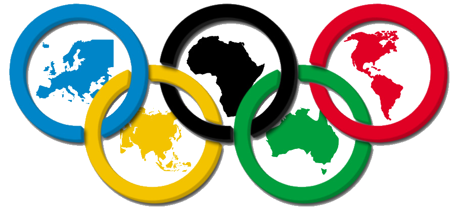
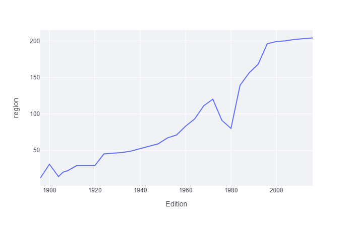
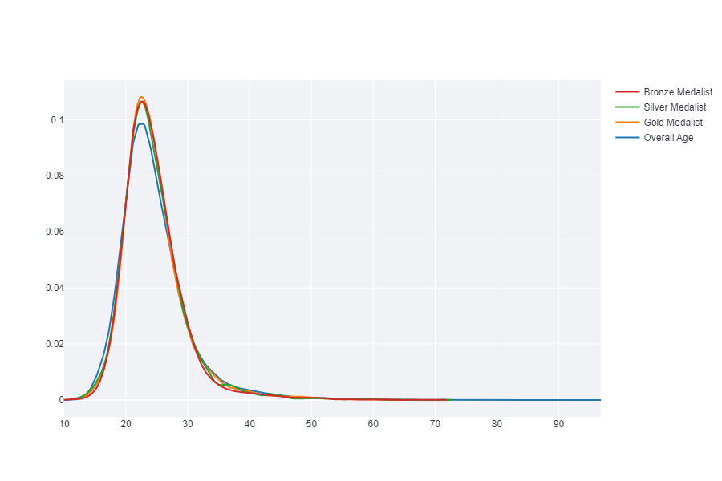

# Olympics-Data-Analysis

## Dataset:
The dataset is downloaded from **kaggle: 120 years of Olympic history: athletes and results**

Dataset Link: https://www.kaggle.com/heesoo37/120-years-of-olympic-history-athletes-and-results

## Objective:
This project shows the user the overall analysis of summer olympics from the year 1896 upto the year 2016. The user can clearly visualize in the 
form of graphs and charts and can get a brief idea on the overall Analysis, Medal Tally of each country along with the athletes participating in 
various events, also country-wise analysis like which country excels in which sport, number of medals they have won in that specific events, top athletes
winning gold medals, number of male and female participation for the respective years and so on.

## Data Cleaning and Preparation:
This Olympics data is collected from year 1896 till year 2016 which were held every four years. The data contains various columns like name, sex, age, height,
weight, teams, games, season, sport, event, medal. In this data the column season contains two categories i.e. summer and winter. Here data analysis is done only
on the summer olympics data which was held during these years. All the null and duplicate values were taken care during data cleaning and preparation as per required.

## Data Visualization:
### Overall Analysis
* Top Statistics

This statistics shows no. of editions held, total no. of nations hosted the olympics, total no. of sports that have been played, no. of events conducted, no. of nations and athletes participated.

* Participating Nations Over the Years

This graph helps to visualize the number of nations participating over the years.

* No. of Events over time(Every Sport)

Basically this heatmap shows the user a clear picture of number of events conducted for each sport over the years.

### Athlete-wise Analysis
* Distribution of Age

Here we can see the age distribution of athletes winning the medals. The age range between 20 to 30 shows the highest probability of winning a medal.

* Men Vs Women Participation Over the Years

By looking at this 'Men Vs Women Participation' graph it is clearly visible that as the years pass the participation of women goes on increasing and almost equals with that of men.

## Webapp Link:
To get the detailed analysis click the webapp link given below.

Link : https://olympics-summer-data-analysis.herokuapp.com/

## Technologies Used:
* PyCharm is used for IDE.
* For creating webapp Streamlit framework is used.
* Heroku is used for Model Deployment.
